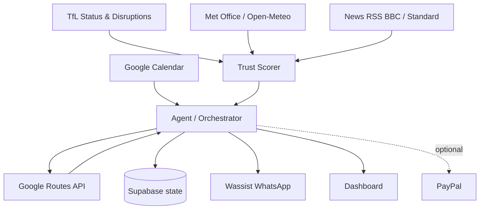

# 02 — Architecture

## System diagram



ASCII fallback:

```
 Google Calendar
        |
        v
 +----------------+      +--------------------+
 |  Orchestrator  |<---->|  Google Routes API |
 +----------------+      +--------------------+
   ^   |  |  |
   |   |  |  +----------------> Supabase (state)
   |   |  +-------------------> Wassist WhatsApp
   |   +----------------------> Dashboard
   |   ......................-> PayPal (optional)
   |
 +----------------+
 | Trust Scorer   | <--- TfL
 +----------------+ <--- Met Office / Open-Meteo
                    <--- News RSS
```

## Core loop (every 5 minutes)

1. **Fetch calendar events** for today (`events.list`, `calendar.readonly`).
2. **Geocode + cache locations**; skip virtual meetings (Zoom/Meet/Teams links, "online", no address).
3. **Build legs chronologically** — meeting times are fixed; each leg is `from previous location → next location`.
4. **Call Routes API per leg** in the relevant mode (transit / drive / walk), requesting both traffic-aware and traffic-unaware.
5. **Compute baseline vs observed anomaly** using seasonal multipliers (see `05-baseline-anomaly.md`).
6. **Poll event feeds → cluster → trust score** (see `08-trust-scoring.md`).
7. **Match events to legs → attribute delay** to specific verified causes.
8. **Compute `leave_by`** for each upcoming leg.
9. **Notify if changed** — only send a WhatsApp when the leave-by or status meaningfully changes (anti-spam).
10. **Escalate if impossible** — if no feasible departure makes the next meeting, flag for human oversight and stop auto-nudging.

## Deploy options

- **Next.js on Vercel + Supabase (fastest):** UI, API routes, and Supabase for state; a Vercel cron hits the loop endpoint every 5 minutes. Best for the hackathon.
- **Modal:** Python webhook/cron workers for the agent loop and feed polling, with Supabase as the shared state bus. Use if the team prefers Python or needs longer-running jobs.
