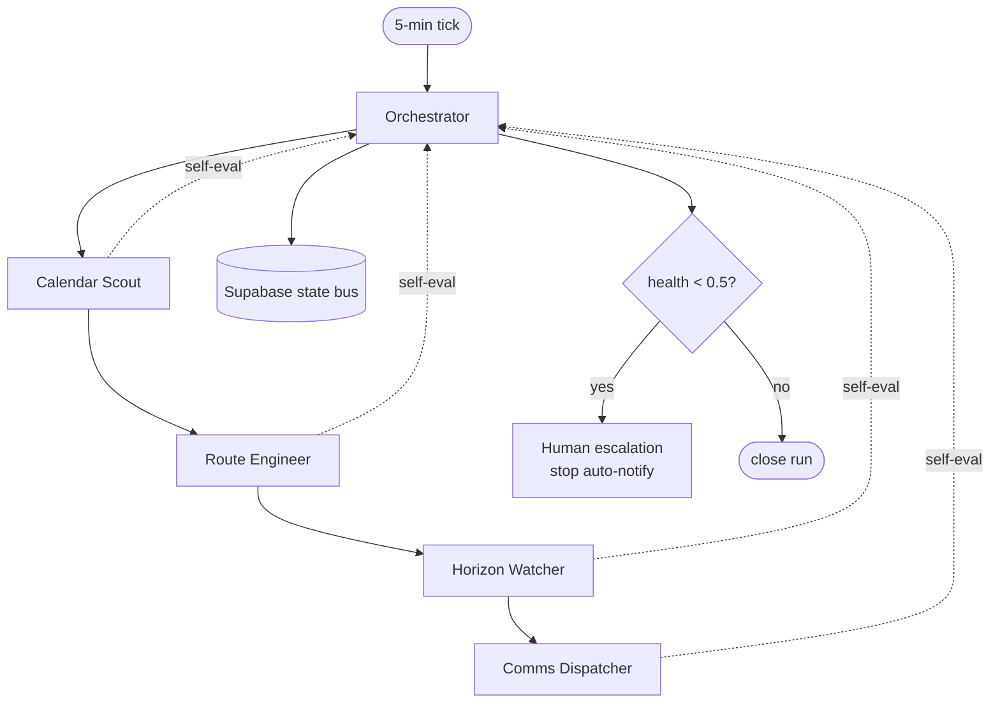

# 12 — Five agents

RouteOps runs as **five self-evaluating, self-healing agents** orchestrated around Google + other APIs. Workers are **plain code**; a single small LLM is used **only** for news classification. **Supabase rows are the message bus** (no Kafka). For the demo, "self-healing" means **retry + cache + escalate** — nothing fancier.

## Agents overview

| # | Agent | Job | APIs |
| --- | --- | --- | --- |
| 1 | **Calendar Scout** | Read meetings, validate locations, build the day graph | Google Calendar, Geocoding |
| 2 | **Route Engineer** | Compute legs, modes, leave-by, baseline vs anomaly | Google Routes |
| 3 | **Horizon Watcher** | Ingest disruptions, trust-score, attribute causes | TfL, Met Office / Open-Meteo, RSS |
| 4 | **Comms Dispatcher** | Turn decisions into WhatsApp, avoid spam | Wassist |
| 5 | **Orchestrator** | Run the loop, delegate, merge state, escalate | Supabase (state bus) |

---

## 1. Calendar Scout

- **Input:** user_id, today's window.
- **Output:** ordered `events_cache` rows with coords + `is_virtual` + `location_tokens`; the day graph (ordered legs).
- **Steps:** OAuth refresh → `events.list` → drop virtual meetings → geocode (cache-first) → emit ordered nodes.

| Self-evaluate check | Fail condition |
| --- | --- |
| Auth valid | OAuth refresh failed |
| Events parsed | 0 events when calendar non-empty |
| Geocode coverage | > 20% of physical events ungeocoded |
| Ordering | Events not chronologically sortable |

- **Self-heal:** OAuth expired → pause + request reconnect; bad geocode → re-geocode with cleaned address, else escalate the single leg.

## 2. Route Engineer

- **Input:** day graph (ordered nodes), current time, user mode pref.
- **Output:** `route_runs.legs_json` with observed/baseline/seasonal/anomaly/status/leave_by.
- **Steps:** for each leg → select mode → Routes traffic-aware + traffic-unaware → seasonal_expected → anomaly → leave_by → flag infeasible legs in `conflicts_json`.

| Self-evaluate check | Fail condition |
| --- | --- |
| Routes responded | API error / timeout on a leg |
| Durations sane | Negative or absurd duration |
| Baseline present | traffic-unaware call missing |
| Leave-by computable | next meeting start missing |

- **Self-heal:** Routes down → use cached route + "stale" badge; single bad leg → mark `unexplained` rather than failing the run.

## 3. Horizon Watcher

- **Input:** active legs + corridors.
- **Output:** normalized `events` rows with `cluster_id` + `trust_score`; `leg_attributions`.
- **Steps:** poll feeds → normalize (LLM classify headline only) → cluster → trust score → match to legs → write attributions.

| Self-evaluate check | Fail condition |
| --- | --- |
| Feeds reachable | All feeds failed |
| Normalization | Uncategorizable items > 30% |
| Trust determinism | Score outside [0,1] |
| Attribution sanity | Auto-act on Tier3-only cluster |

- **Self-heal:** TfL/feed down → use cached events; false stale alert → downgrade trust + suppress; classifier failure → keyword fallback.

## 4. Comms Dispatcher

- **Input:** changed leave_by / status, escalations.
- **Output:** `notifications` rows + delivered WhatsApp messages.
- **Steps:** diff against last sent → build message → send via Wassist → mark sent → rate-limit per user.

| Self-evaluate check | Fail condition |
| --- | --- |
| Change-only | Sending unchanged message |
| Delivery | Wassist non-2xx |
| Rate limit | > N messages / window |
| Tone safety | Graphic/unverified content in body |

- **Self-heal:** WhatsApp down → queue + retry with backoff; persistent failure → surface on dashboard + escalate.

## 5. Orchestrator

- **Input:** schedule tick (every 5 min).
- **Output:** `orchestrator_runs` row with merged state + `health_score`; escalations.
- **Steps:** open run → invoke Scout → Route Engineer → Horizon Watcher → Comms → collect self-evals → compute health → escalate if needed → close run.

| Self-evaluate check | Fail condition |
| --- | --- |
| All agents ran | Any agent never returned |
| Health threshold | health_score < 0.5 |
| Freshness | State older than 2 cycles |
| Escalation wired | Impossible day not flagged |

- **Self-heal:** multiple agent failures → human escalation + **stop auto-notify**; partial failure → run degraded with stale badges.

---

## Orchestration diagram

## Shared self-evaluation rubric

Each agent reports `confidence = passed_checks / total_checks`:

| Confidence | State |
| --- | --- |
| ≥ 0.8 | **ok** |
| ≥ 0.5 | **degraded** |
| < 0.5 | **failed** |

**Orchestrator health score** = `min(agent confidences) × freshness_factor`, where `freshness_factor` decays as state ages (1.0 fresh → lower as cycles are missed).

## Self-healing playbook

| Failure | Self-heal action |
| --- | --- |
| OAuth expired | Calendar Scout pauses → request reconnect |
| Bad geocode | Re-geocode cleaned address → else escalate that leg |
| Routes down | Serve cached route + "stale" badge |
| TfL / feed down | Serve cached events |
| False stale alert | Downgrade trust + suppress notification |
| WhatsApp down | Queue + retry with backoff |
| Multiple agent failures | Human escalation, **stop auto-notify** |

## Implementation notes

- **Code workers** for everything deterministic; **one small LLM** only for news classification (`{category, location_tokens}`) + dedupe.
- **Supabase rows** as the message bus — no Kafka, no queue infra.
- For the demo, implement **retry + cache + escalate** only. Don't over-engineer self-healing.
